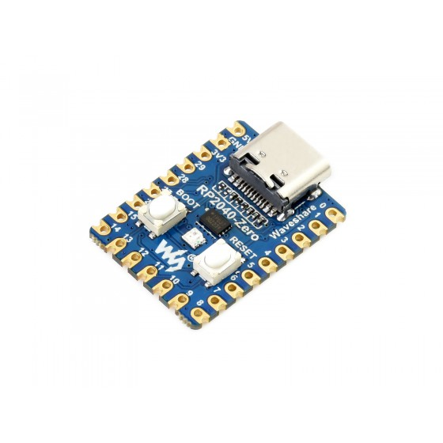
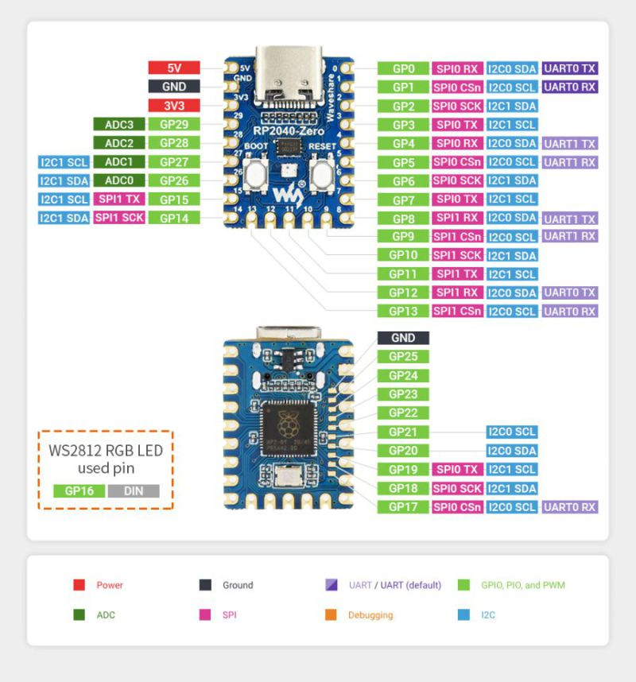
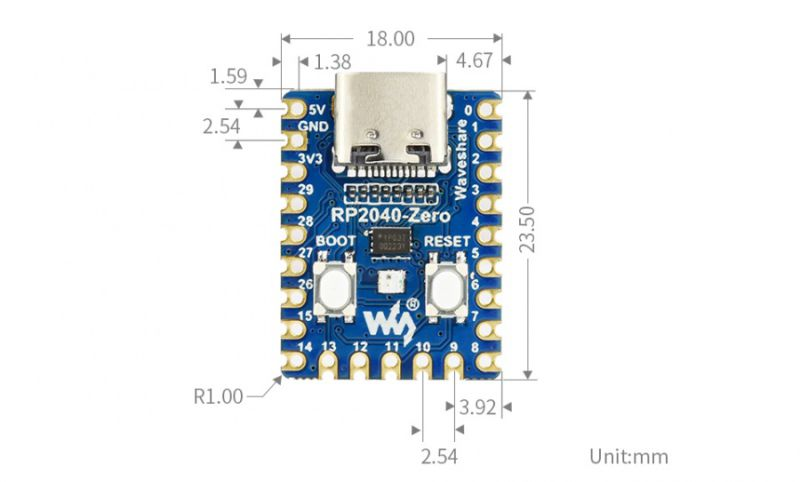

# Hardware

The hardware is based off of a RP2040-Zero microcontroller, running [CircuitPython](https://circuitpython.org/). I chose this device because:

- Supports USB HID, and I wanted to learn USB communications. USB is also simpler setup on the host PC, as I don't need to worry about choosing and configuring COM ports for serial communication
- Small footprint, so I can easily fit this into a small 3D-printable enclosure
- Low-cost. I found a 3-pack on Amazon for around $10
- CircuitPython support, which I have some past experience with. I really like the easy development-loop experience of just updating script files directly on the device.
- Includes a built-in RGB LED, which I can use for visual feedback (unless I find it's not bright enough on its own)

## Reference Images

## Hardware Setup

1. Download the CircuitPython build for the RP2040-Zero: https://circuitpython.org/board/waveshare_rp2040_zero/ (Currently v10.2.0 at the time of this writing)
2. Plug the board into a USB port and copy the downloaded `.uf2` file to the drive of the RP2040-Zero
3. The device will reboot and show up as a new drive called `CIRCUITPY`

## Deploying Code

Source code for the device lives in the `device/src` directory. Make any changes there, and run the `deploy.ps1` powershell script to copy any updated files to the circuitpython drive. The script will find the circuitpython drive and copy files to it.

## USB HID Report Descriptor

USB HID (Human Interface Device) is a standard for devices that interact with humans, such as keyboards, mice, game controllers, etc. The HID report descriptor is a data structure that describes the format of the data that the device will send to the host computer. It defines the types of inputs and outputs the device has, and how they are structured. Generating these descriptors can be complex, and that's where `Waratah` comes in.

Waratah is a tool from Microsoft for generating USB HID descriptors, using a .wara file to define the HID descriptor in a more human-readable way.

Waratah Links & information

- https://github.com/microsoft/hidtools
- https://github.com/microsoft/hidtools/wiki

To install, run the command `winget install Microsoft.HIDTools.Waratah`

In this project, the `hid_descriptor` directory contains a small development environment for building the report descriptor.

- `descriptor.wara` acts as the "source code" for the descriptor
- `generate.ps1` script runs the Waratah tool to build a report descriptor from the .wara file. Waratah by default only generates a C code file, so the powershell script pulls out the raw data and builds a python-compatible byte array that can be copied into the CircuitPython project.

Other relevant USB HID links:

- https://eleccelerator.com/tutorial-about-usb-hid-report-descriptors/
- https://www.usb.org/hid
- https://docs.circuitpython.org/en/latest/shared-bindings/usb_hid/

Web-based HID Explorer tool for testing USB device:

- Github repo: https://github.com/paulirish/webhid-explorer
- Live tool: https://paulirish.github.io/webhid-explorer/
